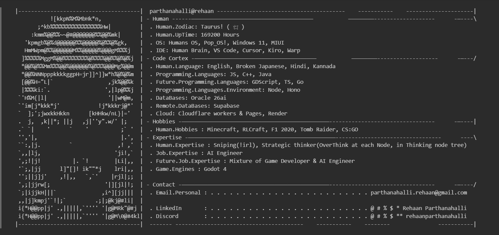

---

  
  <h1>REHAAN PARTHANAHALLI</h1>
  
<strong>AGENTIC AI DEVELOPER</strong> · BUILDING AUTONOMOUS NETWORKS THAT THINK, DECIDE &amp; ACT

  
  
  

---

## ABOUT ME

- I BUILD **AGENTIC AI NETWORKS** - AUTONOMOUS AGENTS THAT REASON, PLAN AND TAKE ACTION
- I CODE FOR THE INNER SELF, ONE DELIBERATE COMMIT AT A TIME
- TRAINED ON [SCRIMBA](https://scrimba.com/?via=u42d12d6) - THE PLATFORM THAT KILLED OLD-FASHIONED EDUCATION

> **⚡ SCRIMBA REWIRED HOW I LEARN TO CODE.**

> **TASTE IT FREE - IF IT HITS, GO PRO. NO FLUFF, JUST RESULTS.**

---

## WHAT I BUILD

|  |  |  |
|:---:|:---|:---|
|  |     |    |
|  |    |   |
|  |  |    |
|  |  |   |

---

## TOOLKIT

---

## SCRIMBA COURSES COMPLETED

---

## CONNECT

THE BEST COLLABS START WITH A SINGLE MESSAGE - REACH OUT.

---

  BUILT WITH OBSESSION · SHIPPED ON SCRIMBA

